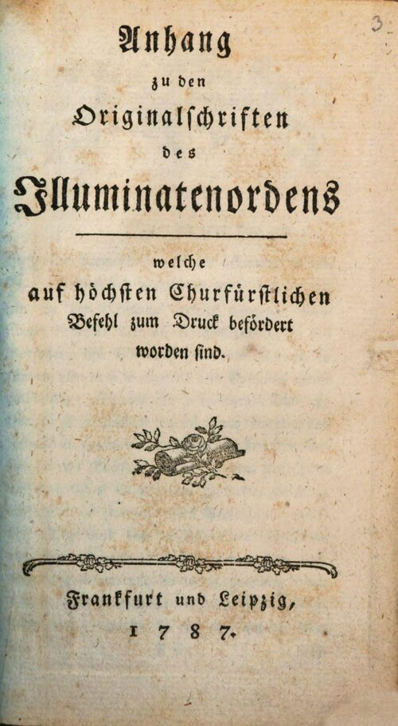
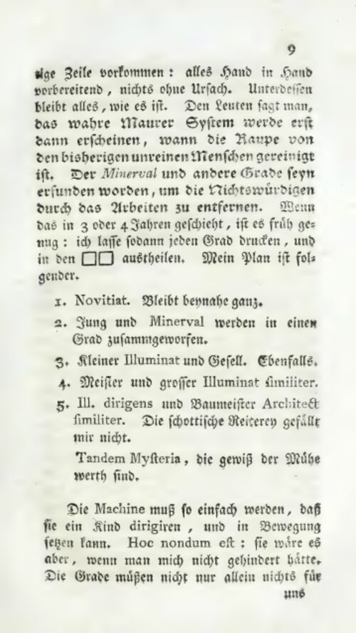
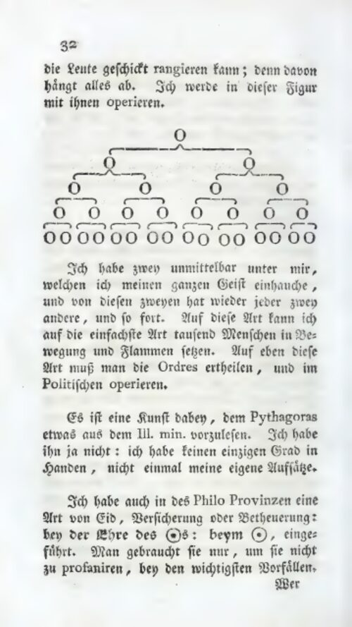
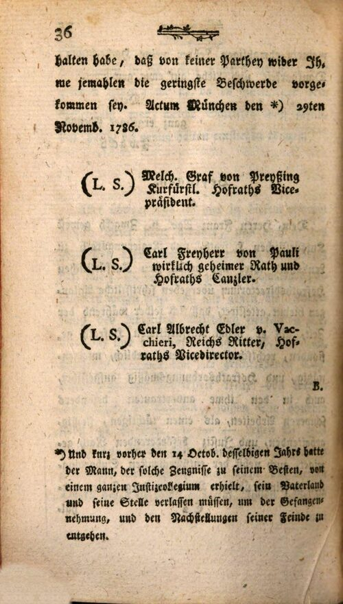

# The Illuminati Papers

### A verified, fully traceable English translation of the documents seized from the Bavarian Illuminati and published in 1787

  
  
  
  

In 1785, the Electorate of Bavaria outlawed the Illuminati (the secret order
founded by Adam Weishaupt in 1776) and raided the homes of its leaders. Two
years later, the government published what it had found: letters, internal
instructions, membership records, and defense statements, issued as three
volumes:

- ***Einige Originalschriften des Illuminatenordens*** (1787): the main collection
- ***Nachtrag von weitern Originalschriften*** (1787): the supplement
- ***Anhang zu den Originalschriften des Illuminatenordens*** (1787): the appendix, containing Xaver von Zwack's point-by-point defense letter

These three publications are the primary source record of the order that became
a legend: the raw material for two centuries of scholarship, speculation, and
conspiracy theory. Partial English excerpts have appeared before, in hostile
18th-century polemics (Robison 1798, Barruel 1799) and in an independent
researcher's translation of the main volume's first ~60 pages (Terry Melanson,
2008-2020, from a French intermediary), but no complete scholarly English
translation of any of the three documents has ever existed. The *Anhang* has no
known English translation, complete or partial; this is the first. (Surveyed
August 2026: library catalogs, archive.org, German national catalogs, the
Source Library collection, and other web-search-indexed records; WorldCat and
HathiTrust were checked via indexed search results, not their own catalog
interfaces.)

This repository publishes the first complete, verified, fully traceable English
translation of the *Anhang*, built from the original scans rather than from
another translation, with the Nachtrag and the main volume in progress (see
Status).

## The three documents

Three volumes, three different kinds of thing:

- **The main volume**, *Einige Originalschriften des Illuminatenordens*
  (~430 pages): the papers seized at Zwack's house search in Landshut
  (October 1786). The Order's cipher, member register, statutes, rituals,
  and the internal correspondence between code-named members (Spartacus,
  Philo, Cato, Ajax). The government's principal evidence.
- **The supplement**, *Nachtrag von weitern Originalschriften* (~436
  pages): documents from the Bassus castle search and later seizures,
  centered on the Order's founder Adam Weishaupt: his "Spartacus" letter
  series, recruiting and leadership tactics, organizational correspondence.
- **The appendix**, *Anhang zu den Originalschriften* (40 pages): Xaver
  von Zwack's point-by-point defense letter, written from Wetzlar in May
  1787 against the accusations built from the other two volumes. The only
  one of the three with no English translation anywhere, and the one this
  repository publishes in full.

## What differentiates this from previous translations

- **Corrected German source text.** The raw OCR of 18th-century Fraktur is
  unreliable: misread letters, dropped words, garbled passages, lost long-s and
  umlauts. Every page here has been corrected by direct visual inspection of
  the page images, and **every single correction is logged** with its reason
  (`page — raw OCR → corrected — why`). You can audit the text word by word.
- **Verification you can repeat.** A pilot sample (7 pages across the three
  documents) received a separate evaluation pass with before/after records that
  validated the method; full correction then proceeded page by page with every
  change logged, so any page can be independently checked against the scan.
- **Independently verified translation.** The *Anhang* translation has been
  through five independent adversarial verification passes (September 2026):
  each pass produced a fresh translation from the corrected German and compared
  it against the literal and scholarly passes published here. Every confirmed
  discrepancy was fixed in the files as published.
- **Three translation layers.** A structure-preserving *literal* translation, a
  polished *scholarly* translation, and a plain-language *narrative* companion
  that tells each document's story for the general reader; all three cite back
  to the same page numbers.
- **Page-level citations throughout.** Every annotation, every uncertain
  reading, every historical term points to the scan page it came from.
- **Cross-checked against other translations.** Where other English
  translations exist (e.g., the AI-assisted versions published by Source
  Library in July 2026, or older partial translations by Robison, Barruel, and
  Melanson), they are checked against and cited as a baseline for comparison,
  never a source to copy. The Anhang has no such baseline: this translation
  is the first.
- **Fully transparent method.** This is an AI-assisted project: every
  correction and translation pass is logged, reviewable, and reproducible from
  the public artifacts in this repository. Human review is the final gate
  before each document is declared finished.

## The method

The purpose of this method is that every word is traceable. Each document
moves through the same pipeline, and every stage is published:

1. **Acquire**: original scans from the Internet Archive (Duke University
   copy) and the Bavarian State Library (MDZ), with provenance recorded.
2. **Normalize**: deterministic cleanup of the raw OCR (dehyphenation,
   paragraph reflow). No guessing, no spelling changes.
3. **Correct**: page-by-page correction against 300 DPI page images, with a
   citable change record: `page — raw OCR → corrected — reason`. Original
   18th-century spelling (long ſ, etc.) is preserved as printed.
4. **Translate**: context extraction pass, then literal → scholarly →
   narrative translations.
5. **Annotate**: people, institutions, historical terminology, and uncertain
   readings, each cited to scan pages.
6. **Publish**: everything released here, in a reusable format.

## Model choices

Two surveys guided the tooling choices:

- **OCR.** The realistic options for printed 18th-century Fraktur were
  evaluated: Tesseract's Fraktur models, Kraken with published historical-
  print models (e.g. CATMuS-Print), Calamari-OCR (trained on GT4HistOCR, a
  public ground-truth corpus of German Fraktur), Transkribus, and vision
  language models. Conclusion: the existing raw OCR from the Internet
  Archive and the Bavarian State Library, corrected page by page against the
  scans, was the right starting point: training a custom model had no
  ground truth to train on until the correction itself existed. The decision
  is revisited if correction ever reveals a high error rate.
- **Translation.** Translation models and general LLMs were surveyed for
  archaic German specifically, including the Transnormer normalization
  models for 18th-19th-century German, OPUS-MT and QuickMT baselines, and
  current general-purpose models. General LLMs with a historical-context
  prompt won for the literal pass; DeepL was rejected as built for modern
  text. Verification is done with multiple independent models chosen for
  complementary strengths (German competence, long-context handling,
  logic-level reasoning), so no single model's blind spots go unexamined.

## Status

| Document | Transcription | Correction | Translation | Annotations |
|---|---|---|---|---|
| *Einige Originalschriften* (1787) | done | not started | not started | not started |
| *Nachtrag* (1787) | done | **in progress** (73 of 436 pages) | not started | not started |
| *Anhang* (1787) | done | **done** | **done** (literal + scholarly + narrative) | **done** |

The *Anhang*, Zwack's 1787 defense letter from Wetzlar, is complete
end-to-end and is the project's flagship artifact: corrected transcription,
full correction log, literal, scholarly, and narrative translations, and
annotations, all page-cited.

## Repository layout

| Path | Contents |
|---|---|
| `scans/` | Original page scans (PDF), one folder per document |
| `ocr_raw/` | Raw OCR output (German, Fraktur), unedited, with provenance notes |
| `transcriptions/` | Corrected German transcriptions + correction logs + evaluation samples |
| `translations/literal/` | Structure-preserving literal English translation |
| `translations/scholarly/` | Polished scholarly English translation |
| `translations/narrative/` | Plain-language narrative companion, page-cited |
| `annotations/` | Notes on people, institutions, terms, uncertain readings |
| `metadata/document_index.csv` | Master index of the documents |
| `research/source_documents/` | Surveys of related publications and existing translations |
| `src/` | Pipeline tooling (e.g., `normalize_ocr.py`) |

## Related resources

The partial English translations and modern scholarship referenced above:

- **John Robison, *Proofs of a Conspiracy* (1798)**: full text at [Project
  Gutenberg](https://www.gutenberg.org/files/47605/47605-h/47605-h.htm);
  [1798 edition at the Internet Archive](https://archive.org/details/bim_eighteenth-century_proofs-of-a-conspiracy-a_robison-john_1798_0)
- **Augustin Barruel, *Memoirs Illustrating the History of Jacobinism* (1799,
  trans. Robert Clifford)**: [Internet Archive, vol. 1](https://archive.org/details/memoirsillustrat01barr),
  [vol. 2](https://archive.org/details/memoirsillustrat02barr),
  [vol. 3](https://archive.org/details/memoirsillustrat03barr),
  [vol. 4](https://archive.org/details/memoirsillustrat04barr)
- **Terry Melanson's partial translation** of the main volume (title page–p. 60,
  from a French intermediary): [archived at the Wayback Machine](https://web.archive.org/web/2020/https://www.conspiracyarchive.com/2020/01/01/some-original-writings-of-the-order-of-the-illuminati-title-p-12/)
- **Source Library's AI-assisted English translations** of the main volume and
  Nachtrag (July 2026): [sourcelibrary.org](https://sourcelibrary.org)
- **Josef Wäges & Reinhard Markner (eds.), *The Secret School of Wisdom* (Lewis
  Masonic, 2015)**: scholarly ritual compilation, [publisher page](https://www.lewismasonic.co.uk/esoteric/the-secret-school-of-wisdom-paperback-the-authentic-rituals-and-doctrines-of-the.htm)

## License

The source documents (1787) and the scans are public domain. The corrected
transcriptions, translations, and annotations in this repository are original
works published under [CC BY-SA 4.0](https://creativecommons.org/licenses/by-sa/4.0/).

---

*This project is historical scholarship: it translates and publishes the
primary sources.*
